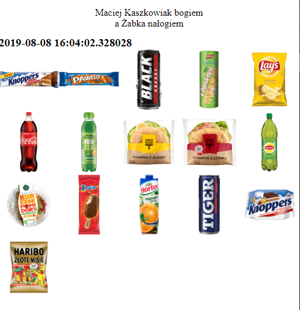
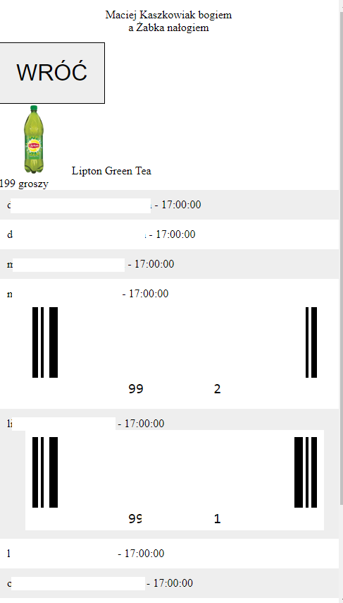

# zabka-as-a-service
ŻaaS for all of your hot-dog needs

Allows you to quickly access Żabka's 2-hour promotions for multiple accounts at once. 

### Setup:
1. register the żappka accounts, verify them
2. generate the access tokens
3. setup cron to run zaba.sh hourly (I run it twice on :03, :08), modify it to your own needs
4. change the password in env.php
5. enjoy your hot-dogs

### Unprovided:
- *synerise_client_api_key*, it's Żappka's property so I have no rights to include it in this repo
- uuid, just generate one randomly
- emails & passwords - you need to register each account & verify email for each of them btw
- a deployment script, as my VPS configuration is quite unusual and specific, just write your own bash script

### It ain't pretty
But it works & it's mobile friendly - I'm too lazy to create a design lol

### Notes
Once someone uses a promotion, it won't disappear from the list until the next update. Removing such promotions would require a trust-based system, which wouldn't be 100% accurate for a larger number of people. 
